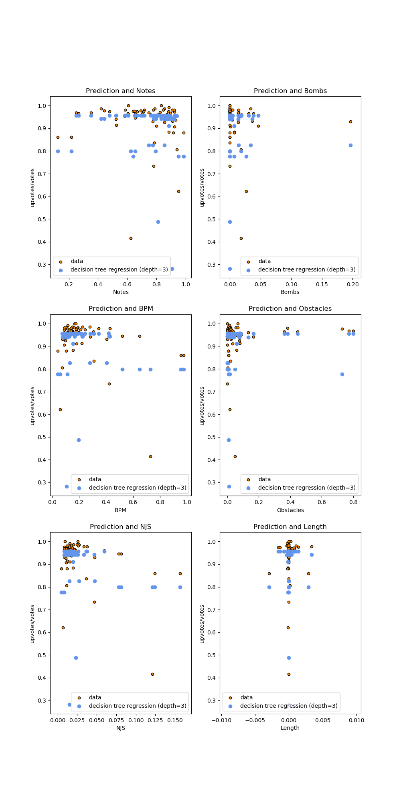

# Beat Saber Map Analysis
| Ethan Nguyen, Michael Mitsch, Wyeth Michaelsen, Drew Willis

---

Keywords: Beat Saber, BeatSaver

---
## Abstract
In a virtual reality rhythm game called Beat Saber, players play on different maps that play different songs where they have to hit approaching cubes to the beat of the music. A website called BeatSaver is a place for users to upload custom maps, and others to play and rate them. This website has an API that returns various information on each map such as the beats per minute, or song length. We created a web API based tool that to download data from the website's api and store it in a MongoDB. Using this data we trained a decision tree regression model to analyze the most important features of these maps to predict the reception of a map.

## Introduction
The goal of our model is to analyze the features of the maps, comparing the maps based on the ratio of upvotes/downvotes. We use a Dockerized interface to download the requirements and run the service remotely. Using Flask with Connexion, we created an endpoint to download a csv from a Google Drive link, which we store and access using MongoDB. We can also scrape for new data and store multiple datasets. We use this data to train decision tree regression models that can be tested and used to predict the reception of other maps' datasets.

## Background
We want to analyse the most important features of these maps to predict
We plan to utilize the following characteristics to predict the reception of the map:
* Song BPM
* Song Length
* Amount of:
    * Difficulties
    * Notes
    * Bombs
    * Obstacles (Walls)
    * NJS (Note Jump Speed) and Offset
We judge each map based on Upvotes/Downvotes or a ratio between them.
At first the models did not do very well because of skewed data. When we normalize the data with upvotes/downvotes, the maps with very low popularity will have mostly random features. We solved this by setting a minimum of upvotes for the data to be used.

## Methods
We created a function to prepare the data that takes a DataFrame of the data and a minimum amount of votes to train/test on. It weeds out accounts with total votes less than a minimum votes amount, set by us. Then it creates an np array of the data, normalizes each feature in the data, and returns numpy ndarray of normalized data set with instances that have more than the minimum votes.

We plot points of data with ratings against features.
## Implementation
We start with a Makefile to run the necessary commands to build and start the Docker containers needed to run the server. The Dockerfile installs the necessary requirements and runs server.py in a container. This uses Connexion with Flask to handle our master.yaml file. In master.yaml, there are endpoints for each of the functions within serverDriver.py.
The contained functions are:
### getNewBeatSaverMaps(startKey, stopKey)
This function uses scrape to retrieve new maps and stores them in the MongoDB within the range provided in the arguments.
### importDataFromGoogle(urlID):
This function downloads a csv file from a Google Drive download link ID containing map data. It stores this data in the MongoDB.
### availMaps():
This function lists the maps stored in the MongoDB.
### trainModel(modelName):
This function trains the decision tree regression model on the imported data and requires a name as an argument.
### runPrediction(modelName):
This function runs a named trained model against all of the maps in the MongoDB and produces a png containing the plots with its accuracy.

### availModels():
This function lists the available trained models. This will yield multiple results if more than one model was trained at the trainModel endpoint.

## Specification
```openapi: 3.0.0
info:
  version: "1.0.0-oas3"
  title: Prediction of Beat Saber Scores
  description: Predict Beat Saber song user score based on features
  termsOfService: 'http://swagger.io/terms/'
  contact:
    name: 'Wyeth Michaelsen, Michael Mitsch, Ethan Nguyen, Drew Willis'
  license:
    name: Apache

paths:
  '/run/{modelName}':
    get:
      operationId: scripts.serverDriver.runPrediction
      description: Displays upload file page
      parameters:
        - name: modelName
          in: path
          description: The model that needs to be fetched.
          required: true
          schema:
            type: string
      responses:
        '200':
          description: Upload page displayed successfully
          content:
            application/json:
              schema:
                $ref: "#/components/schemas/responImage"
  '/train/{modelName}':
    get:
      operationId: scripts.serverDriver.trainModel
      description: Trains model on data.
      parameters:
        - name: modelName
          in: path
          description: The name of the model to save as.
          required: true
          schema:
            type: string
      responses:
        '200':
          description: Model trained successfully
          content:
            application/json:
              schema:
                $ref: "#/components/schemas/responString"

  '/getMaps/{startKey}/{stopKey}':
    get:
      operationId: scripts.serverDriver.getNewBeatSaverMaps
      description: Pulls new Beat Saver Maps
      parameters:
        - name: startKey
          in: path
          description: Hex Key of which map to start requesting
          required: true
          schema:
            type: string
        - name: stopKey
          in: path
          description: Hex Key of which map to stop requesting
          required: true
          schema:
            type: string
      responses:
        '200':
          description: Map retrieval was successful
          content:
            application/json:
              schema:
                $ref: "#/components/schemas/responString"

  '/importGoogleData/{urlID}':
    get:
      operationId: scripts.serverDriver.importDataFromGoogle
      description: Gets url data from google 
      parameters:
        - name: urlID
          in: path
          description: ID of the url for the stored data on google
          required: true
          schema:
            type: string
      responses:
        '200':
          description: Data retrieval was successful
          content:
            application/json:
              schema:
                $ref: "#/components/schemas/responString"

  /availableMaps:
    get:
      operationId: scripts.serverDriver.availMaps
      description: New maps available for training
      responses:
        '200':
          description: File upload successful
          content:
            application/json:
              schema:
                $ref: "#/components/schemas/responString"
          
  /availableModels:
    get:
      operationId: scripts.serverDriver.availModels
      description: Available models 
      responses:
        '200':
          description: File upload successful
          content:
            application/json:
              schema:
                $ref: "#/components/schemas/responString"

servers:
  - url: http://localhost:8080/api/
components:
  schemas:
    responString:
      type: object
      required:
        - model
      properties:
        model:
          type: string
    responImage:
      type: object
      required:
        - model
      properties:
        model:
          type: string
          format: binary
```
## Conclusion
Our method of using a decision tree regression model to analyze and predict the reception of a map is functional at this level but, is not ideal. Since many data features could be skewed drastically on maps with low popularity, we ended up filtering out maps with a low vote count. We may want to change our approach for filtering out this data when working on this model further. Overall, the model predicts well enough with the current settings.
